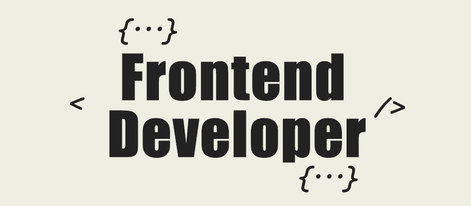

<h1 align="center">Hi 👋, I'm Hagar Ragab</h1>
<h3 align="center">Front End Developer (Technology Passionate)</h3>

  

-   👨‍💻 All of my projects are available at [https://hagar-ragab.netlify.app/](https://hagar-ragab.netlify.app/)

-   💬 Ask me about **HTML, CSS, JavaScript, and React**

-   📫 How to reach me **hagar.ragab.saad@outlook.com**

<h3 align="left">About me:</h3>

💻 Driven and adaptable professional with a background in architecture, interior design, and graphic design, now passionately working in software development as a front-end developer. With a strong   foundation in design principles and years of self-directed learning in web development, I bring a unique blend of creativity and technical expertise.
  
🎓 Studied Architecure from Faculty of Engineering at Alexandria University.

<h3 align="left">Connect with me:</h3>

<h3 align="left">Languages and Tools:</h3>

                    <a href="https://www.adobe.com/products/xd.html" target="_blank" rel="noreferrer">      

<h3 align="left">GitHub stats:</h3>

  
  

